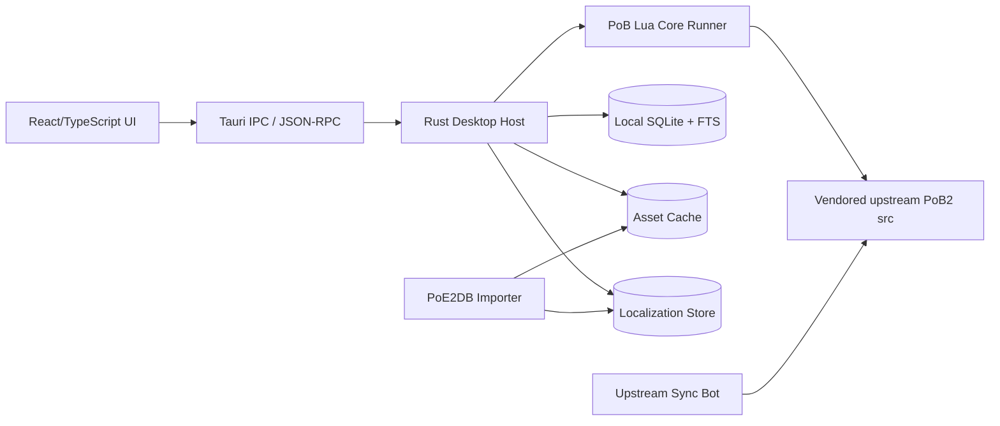
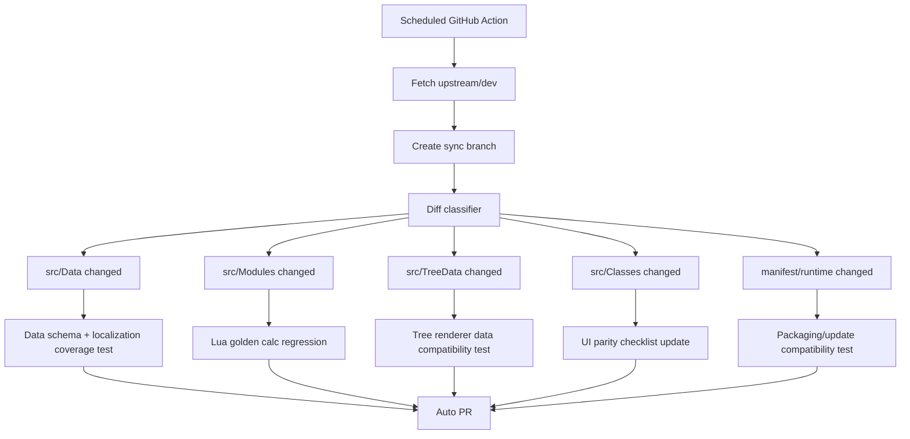
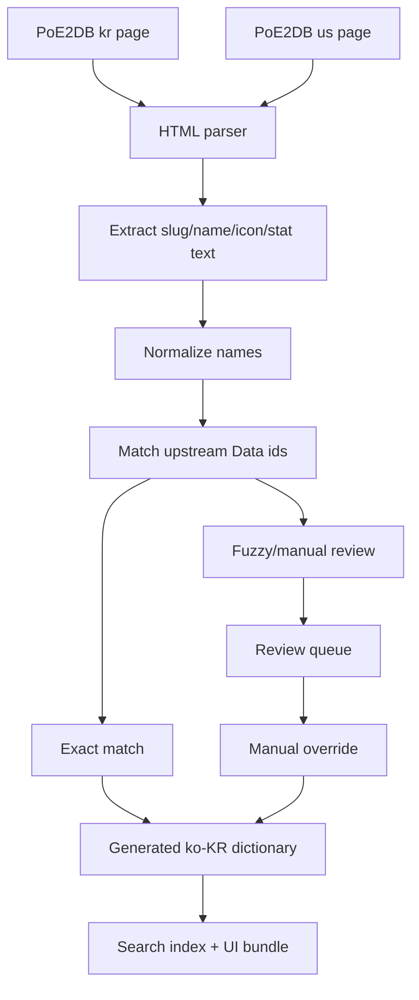

# PoB2 Modern UI Fork 개발 설계 문서

**프로젝트명:** PoB2 Remastered  
**대상 upstream:** `PathOfBuildingCommunity/PathOfBuilding-PoE2`  
**목표:** 기존 Path of Building 2의 계산 정확도와 기능 범위를 유지하면서, 현대적인 데스크톱 UI, 한국어 로컬라이제이션, 데이터/아이콘 보강, upstream 추적 자동화를 갖춘 fork를 구축한다.  
**작성 기준일:** 2026-06-01

---

## 1. 핵심 결론

### 1.1 권장 아키텍처

**권장안:** `Tauri + React/TypeScript + Rust host + Lua core bridge`

기존 PoB2는 소스 트리 기준으로 `src/Modules`, `src/Data`, `src/TreeData`, `src/Classes`가 분리되어 있고, 언어 통계는 Lua 100%로 표시된다. 런타임 디렉터리에는 `lua51.dll`, `SimpleGraphic.dll`, `glfw3.dll` 등 기존 Lua/커스텀 렌더링 기반 실행 환경이 포함되어 있다. 따라서 계산 엔진을 즉시 재작성하지 말고, 기존 Lua 계산/데이터 레이어를 **headless core**로 보존한 뒤 UI만 새로 구축하는 방식이 가장 안전하다. ([GitHub](https://github.com/PathOfBuildingCommunity/PathOfBuilding-PoE2/tree/dev/src "PathOfBuilding-PoE2/src at dev · PathOfBuildingCommunity/PathOfBuilding-PoE2 · GitHub"))

### 1.2 핵심 전략

1. **계산 로직은 보존한다.**  
   PoB2의 핵심 가치는 피해, 방어, 스킬, 패시브, 아이템, 설정 조합 계산의 정확도다. 기존 README도 offense/defence calculation, skill planner, passive tree planner, item planner, import/export, automatic update를 주요 기능으로 명시한다. 동일 기능을 목표로 하려면 Lua 계산 모듈을 유지하고 UI만 대체하는 접근이 우선이다. ([GitHub](https://github.com/PathOfBuildingCommunity/PathOfBuilding-PoE2/blob/dev/README.md "PathOfBuilding-PoE2/README.md at dev · PathOfBuildingCommunity/PathOfBuilding-PoE2 · GitHub"))

2. **UI는 완전 재설계한다.**  
   기존 `Classes` 디렉터리에는 `ItemsTab.lua`, `SkillsTab.lua`, `TreeTab.lua`, `CalcsTab.lua`, `ConfigTab.lua`, 각종 Control 클래스가 혼재한다. 이는 화면 구성과 도메인 로직이 밀접하게 결합되어 있을 가능성이 높으므로, 새 UI에서는 화면 상태, 계산 상태, 데이터 상태를 분리한다. ([GitHub](https://github.com/PathOfBuildingCommunity/PathOfBuilding-PoE2/tree/dev/src/Classes "PathOfBuilding-PoE2/src/Classes at dev · PathOfBuildingCommunity/PathOfBuilding-PoE2 · GitHub"))

3. **로컬라이제이션은 단순 문자열 번역이 아니라 데이터 매핑 문제로 취급한다.**  
   PoE2DB는 한국어 페이지, 영어 페이지, 아이템, 젬, 키워드, 패시브 트리 등 카테고리를 제공하고, `Keywords /974`처럼 대규모 메커니즘 키워드 데이터를 노출한다. 이를 이용하되, 법적/라이선스 위험을 고려하여 “로컬라이제이션 매핑 및 사용자 측 캐시” 중심으로 설계한다. ([poe2db.tw](https://poe2db.tw/kr/ "고향 - PoE2DB, Path of Exile Wiki kr"))

4. **upstream 추적은 자동화하되, 충돌 범위를 최소화한다.**  
   upstream은 PR을 `dev` 브랜치 대상으로 만들 것을 요구하고, fork 최신화도 `upstream/dev`를 기준으로 rebase하는 절차를 안내한다. 이 fork도 upstream을 submodule 또는 vendored mirror로 고정하고, overlay patch를 최소화해야 한다. ([GitHub](https://github.com/PathOfBuildingCommunity/PathOfBuilding-PoE2/blob/dev/CONTRIBUTING.md "PathOfBuilding-PoE2/CONTRIBUTING.md at dev · PathOfBuildingCommunity/PathOfBuilding-PoE2 · GitHub"))

---

## 2. 프로젝트 목표와 비목표

## 2.1 목표

### 기능 목표

- 기존 PoB2의 주요 기능 유지:
  
  - DPS, DoT, 생명력/마나/에너지 보호막, 예약, 버프/오라/충전/저주/몬스터 저항 계산
  
  - 패시브 트리 플래너
  
  - 스킬/보조 젬 구성
  
  - 아이템 붙여넣기, 아이템 세트, 고유 아이템 DB, 희귀 아이템 템플릿, 제작 시스템
  
  - 빌드 import/export/share code
  
  - 업데이트 감지 및 적용 체계  
    위 기능 범위는 upstream README의 feature list를 기준으로 한다. ([GitHub](https://github.com/PathOfBuildingCommunity/PathOfBuilding-PoE2/blob/dev/README.md "PathOfBuilding-PoE2/README.md at dev · PathOfBuildingCommunity/PathOfBuilding-PoE2 · GitHub"))

### UI 목표

- 기존 탭 기반 고밀도 UI를 유지하되, 정보 구조를 재설계한다.

- “한 화면에 전부 노출” 대신 “요약 → 탐색 → 상세 → 비교” 흐름을 적용한다.

- 모든 핵심 상호작용을 검색/명령 팔레트/키보드로 접근 가능하게 한다.

- 아이템, 스킬, 패시브, 계산 결과에 대해 **변경 전후 delta**를 즉시 보여준다.

- 한국어 UI를 기본으로 제공하되, 원문 영문 slug/name도 항상 검색 가능하게 한다.

### 데이터/로컬라이제이션 목표

- UI 문자열 100% 한국어화.

- 게임 용어, 키워드, 아이템, 스킬, 보조 젬, 패시브, 고유명사 한국어화.

- 한국어 클립보드 아이템 텍스트 파싱 지원.

- 영어/한국어 병렬 검색.

- PoE2DB 기반 아이콘/이미지 참조 지원. 단, 재배포 가능 여부는 별도 검토 후 결정한다.

### 유지보수 목표

- upstream `dev` 변경 감지 자동화.

- `src/Data`, `src/Modules`, `src/TreeData`, `src/Export` 변경 유형별 CI 검증.

- 계산 golden test로 fork와 upstream의 계산 결과 차이 탐지.

- 한국어 매핑 coverage report 제공.

## 2.2 비목표

- 초기 버전에서 계산 엔진을 TypeScript/Rust/Dart로 전면 재작성하지 않는다.

- PoB2 mechanics를 임의로 해석하거나 upstream과 다른 계산 체계를 도입하지 않는다.

- 법적 검토 없이 GGG 또는 PoE2DB 이미지 자산을 앱 패키지에 영구 포함하지 않는다.

- 한국어 번역을 임의 의역으로 대체하지 않는다. 가능한 한 게임 내 공식 한국어 용어와 일치시킨다.

---

## 3. 현재 upstream 구조 분석

## 3.1 저장소 구조

upstream의 `src`는 대략 다음과 같은 역할로 나뉜다.

| 디렉터리           | 관찰된 역할                                                                                                      | 새 설계에서의 취급                                              |
| -------------- | ----------------------------------------------------------------------------------------------------------- | ------------------------------------------------------- |
| `src/Modules`  | 계산, 빌드, 모드 파싱, 데이터 접근. `Calcs.lua`, `CalcOffence.lua`, `CalcDefence.lua`, `ModParser.lua`, `Data.lua` 등이 존재 | **보존 대상.** headless core로 래핑                            |
| `src/Data`     | 게임 데이터, 아이템/스킬/모드/고유/월드/젬 데이터. 일부 자동 생성                                                                     | **보존 + 업데이트 감시 대상**                                     |
| `src/TreeData` | 버전별 패시브 트리 데이터. `0_1`~`0_5`, `legion` 등                                                                     | **보존 + 트리 렌더러 입력 데이터**                                  |
| `src/Classes`  | 기존 UI 탭/컨트롤/서비스. `ItemsTab.lua`, `SkillsTab.lua`, `PassiveTreeView.lua`, `ItemListControl.lua` 등            | **직접 사용하지 않음.** 기능 분석 참고용                               |
| `src/Export`   | 게임 데이터 export/generation 스크립트                                                                               | **업데이트/데이터 재생성 파이프라인에 유지**                              |
| `runtime`      | Windows 실행 파일과 Lua/SimpleGraphic 관련 DLL                                                                     | 초기 Windows bridge에서 참고. 장기적으로 cross-platform runner로 대체 |

이 구조는 GitHub 소스 트리와 디렉터리 목록에서 확인된다. ([GitHub](https://github.com/PathOfBuildingCommunity/PathOfBuilding-PoE2/tree/dev/src "PathOfBuilding-PoE2/src at dev · PathOfBuildingCommunity/PathOfBuilding-PoE2 · GitHub"))

## 3.2 기존 개발/업데이트 관행

upstream 기여 문서는 자동 생성 데이터 파일은 직접 수정하지 말고 `src/Export` 쪽 스크립트를 수정 후 exporter를 재실행하라고 명시한다. 또한 mod parsing logic을 변경하면 `Ctrl + F5`로 `src/Data/ModCache.lua`를 재생성하라고 안내한다. 이 fork도 같은 원칙을 따라야 한다. ([GitHub](https://github.com/PathOfBuildingCommunity/PathOfBuilding-PoE2/blob/dev/CONTRIBUTING.md "PathOfBuilding-PoE2/CONTRIBUTING.md at dev · PathOfBuildingCommunity/PathOfBuilding-PoE2 · GitHub"))

upstream 개발 모드에서는 자동 업데이트가 비활성화되며, `F5` 재시작, 콘솔 토글, 디버그 tooltip, modifier 내부 정보 표시 등의 개발 기능이 존재한다. 새 UI에서도 equivalent dev tooling을 별도로 제공해야 한다. ([GitHub](https://github.com/PathOfBuildingCommunity/PathOfBuilding-PoE2/blob/dev/CONTRIBUTING.md "PathOfBuilding-PoE2/CONTRIBUTING.md at dev · PathOfBuildingCommunity/PathOfBuilding-PoE2 · GitHub"))

---

## 4. 기술 스택 결정

## 4.1 후보 비교

| 후보                              | 장점                                                                                                                                                                                                                           | 단점                                                                         | 본 프로젝트 적합도            |
| ------------------------------- | ---------------------------------------------------------------------------------------------------------------------------------------------------------------------------------------------------------------------------- | -------------------------------------------------------------------------- | --------------------- |
| **Tauri + React/TypeScript**    | 작은 앱, Rust backend, 임의 web frontend 사용 가능, Windows/macOS/Linux/iOS/Android 단일 코드베이스 방향성. Tauri 공식 페이지는 small/fast/secure/cross-platform과 OS native web renderer 사용을 강조한다. ([Tauri](https://tauri.app/ "Tauri 2.0 \| Tauri")) | WebView 차이 관리 필요. Lua bridge를 직접 설계해야 함                                    | **1순위**               |
| **Electron + React/TypeScript** | Chromium/Node 기반이라 웹 UI 호환성 우수. Electron 공식 문서는 JS/HTML/CSS로 Windows/macOS/Linux 데스크톱 앱을 만들 수 있다고 설명한다. ([Electron](https://www.electronjs.org/docs/latest/ "Introduction \| Electron"))                                     | 앱 크기, 메모리, 보안 설정 부담. Node 권한 관리 필요                                         | 2순위. 개발 속도 우선이면 선택 가능 |
| **Flutter Desktop**             | Windows/macOS/Linux native desktop app 컴파일 지원, plugin 체계 존재. ([플러터 문서](https://docs.flutter.dev/platform-integration/desktop "Desktop support for Flutter"))                                                                 | Dart 생태계로 이전해야 하고, 복잡한 data grid/search/tooltip/HTML-rich content 구현 비용이 큼 | UI 일관성 우선이면 가능        |
| **Avalonia UI**                 | .NET, XAML, MVVM, 자체 렌더링, DataGrid/TreeView 등 데스크톱 친화 controls. 공식 문서는 Windows, macOS, Linux, iOS/Android, WebAssembly 지원을 설명한다. ([Avalonia 문서](https://docs.avaloniaui.net/docs/welcome "Avalonia documentation"))          | 웹 프론트엔드 생태계 활용이 약함. 고급 시각화와 웹 기반 검색 컴포넌트 재사용이 어렵다                          | C# 팀이면 가능             |
| **Qt/QML**                      | 고성능 native UI, 오래된 데스크톱 툴링                                                                                                                                                                                                   | 라이선스/배포 정책 검토 필요. 웹/TS 생태계 활용 낮음                                           | 보조 후보                 |

## 4.2 최종 권장

### `Tauri + React + TypeScript + Rust + Lua runner`

이 프로젝트는 “데이터가 많고, 검색/필터/tooltip/비교 UI가 복잡하며, 계산 엔진은 기존 Lua를 보존해야 하는” 형태다. 따라서 frontend는 React/TypeScript로 빠르게 복잡한 상태/표/검색 UI를 구현하고, Tauri/Rust는 파일시스템, 업데이트, IPC, 보안, Lua runner process 관리에 집중시키는 구조가 적합하다.

---

## 5. 전체 아키텍처



## 5.1 계층 책임

### UI layer

- React/TypeScript.

- `TanStack Query`로 core API 상태 관리.

- `Zustand` 또는 `Redux Toolkit`으로 UI-only state 관리.

- `TanStack Table` 또는 자체 virtualized table로 대규모 아이템/스킬 목록 렌더링.

- Passive tree는 Canvas/WebGL 기반 별도 renderer.

- 한국어/영어 병렬 검색.

- Command palette, tooltip, inspector, diff panel 제공.

### Rust host layer

- Tauri application shell.

- Lua core runner process lifecycle 관리.

- JSON-RPC schema validation.

- 파일 저장/로드.

- build share code import/export adapter.

- SQLite/FTS local index.

- asset cache.

- update channel 관리.

- crash report와 diagnostic bundle 생성.

### Lua core runner

- 기존 upstream `src/Modules`, `src/Data`, `src/TreeData`를 로드.

- 기존 계산 결과를 JSON으로 직렬화.

- 기존 build XML/share code와 round-trip 호환.

- UI 관련 `src/Classes` 의존을 제거하거나 shim 처리.

- 장기적으로 Lua 모듈 중 UI와 무관한 계산 API만 안정화.

### Data/localization layer

- upstream game data.

- PoE2DB-derived Korean mapping.

- manual override dictionary.

- icon/asset reference manifest.

- search index.

---

## 6. Core bridge 설계

## 6.1 왜 bridge가 필요한가

기존 PoB2의 계산 정확도는 `src/Modules`와 `src/Data`에 축적되어 있다. `Modules`에는 계산, 아이템 도구, 모드 파서, stat describer 관련 파일이 존재하고, `Data`에는 젬, 보스, 모드, 고유, 베이스, 월드 영역 데이터가 존재한다. 이를 재작성하면 회귀 위험이 매우 크다. ([GitHub](https://github.com/PathOfBuildingCommunity/PathOfBuilding-PoE2/tree/dev/src/Modules "PathOfBuilding-PoE2/src/Modules at dev · PathOfBuildingCommunity/PathOfBuilding-PoE2 · GitHub"))

## 6.2 Bridge 형태

초기 버전은 **out-of-process Lua runner**를 권장한다.

```text
Tauri/Rust Host
  └─ spawns
      pob-core-runner
        ├─ Lua 5.1 runtime
        ├─ upstream src/Modules
        ├─ upstream src/Data
        ├─ upstream src/TreeData
        └─ overlay/modern_api.lua
```

### out-of-process를 우선하는 이유

- Lua panic/crash가 UI process를 죽이지 않도록 격리.

- 기존 `lua51.dll`, `lua-utf8.dll`, `lzip.dll`, `socket.dll`, `lcurl.dll`, `re2.dll` 등 런타임 의존성을 그대로 분석 가능. ([GitHub](https://github.com/PathOfBuildingCommunity/PathOfBuilding-PoE2/tree/dev/runtime "PathOfBuilding-PoE2/runtime at dev · PathOfBuildingCommunity/PathOfBuilding-PoE2 · GitHub"))

- IPC contract를 먼저 안정화한 뒤, 필요 시 Rust embedded Lua로 이행 가능.

- 계산 golden test에서 runner를 독립 실행할 수 있음.

## 6.3 Core API 초안

```ts
type BuildId = string;
type Locale = "ko-KR" | "en-US";

interface CoreRequestMap {
  "core.version": {};
  "build.new": { classId?: string; ascendancyId?: string };
  "build.loadXml": { xml: string };
  "build.loadShareCode": { code: string };
  "build.exportXml": { buildId: BuildId };
  "build.exportShareCode": { buildId: BuildId };

  "build.getState": { buildId: BuildId };
  "build.applyPatch": { buildId: BuildId; patch: BuildPatch[] };

  "calc.run": { buildId: BuildId; options?: CalcOptions };
  "calc.explain": { buildId: BuildId; statId: string; activeSkillId?: string };

  "items.parseClipboard": { text: string; localeHint?: Locale };
  "items.createCustom": { baseId: string; mods: ItemModInput[] };
  "items.compare": { buildId: BuildId; itemId: string; slot: string };

  "tree.previewAllocate": { buildId: BuildId; nodeIds: string[] };
  "tree.applyAllocate": { buildId: BuildId; nodeIds: string[] };

  "skills.setGemGroup": { buildId: BuildId; groupId: string; gems: GemInput[] };
  "config.setOption": { buildId: BuildId; optionId: string; value: unknown };
}
```

## 6.4 직렬화 원칙

- Lua table을 그대로 frontend에 노출하지 않는다.

- 모든 응답은 TypeScript schema와 JSON Schema로 고정한다.

- `calc.run` 결과는 “표시용 localized label”과 “기계 판독용 stat id”를 분리한다.

- 계산 결과에는 `sourceTrace`를 포함하여 Calcs 탭의 explainability를 유지한다.

- 오류는 다음 형식으로 통일한다.

```ts
interface CoreError {
  code:
    | "CORE_INIT_FAILED"
    | "BUILD_PARSE_FAILED"
    | "UNKNOWN_MOD"
    | "CALC_FAILED"
    | "LOCALIZATION_MISSING"
    | "UPSTREAM_INCOMPATIBLE";
  message: string;
  details?: unknown;
  upstreamStack?: string;
}
```

---

## 7. Upstream 추적 및 업데이트 설계

## 7.1 Repository 전략

권장 구조:

```text
pob2-modern/
  vendor/
    PathOfBuilding-PoE2/          # upstream dev branch mirror 또는 submodule
  overlays/
    lua/
      modern_api.lua
      headless_bootstrap.lua
      compatibility_shims.lua
  apps/
    desktop/
  packages/
    ui/
    schema/
    localization/
    core-client/
  tools/
    upstream-sync/
    poe2db-importer/
    golden-tests/
```

### 원칙

- upstream 파일은 가급적 수정하지 않는다.

- 필요한 변경은 `overlays/lua`에 둔다.

- Lua `package.path` 우선순위를 `overlays/lua` → `vendor/PathOfBuilding-PoE2/src` 순서로 설정한다.

- upstream update 시 충돌 범위를 최소화한다.

## 7.2 Upstream sync workflow



## 7.3 Diff classifier 규칙

| 변경 영역                                                | 자동 처리                                            | 수동 검토                     |
| ---------------------------------------------------- | ------------------------------------------------ | ------------------------- |
| `src/Data/*.lua`                                     | schema load, search index rebuild, i18n coverage | 신규 stat/mod 의미 확인         |
| `src/Modules/Calc*.lua`                              | golden test 전체 실행                                | 계산 결과 차이 review           |
| `src/Modules/ModParser.lua`                          | item paste fixtures 재실행                          | 한국어 mod parser mapping 갱신 |
| `src/TreeData/*`                                     | tree renderer snapshot, node id consistency      | 새 리그/트리 버전 대응             |
| `src/Export/*`                                       | exporter dry run                                 | upstream exporter 변경 반영   |
| `manifest.cfg`, `UpdateCheck.lua`, `UpdateApply.lua` | packaging test                                   | 업데이트 정책 충돌 검토             |
| `src/Classes/*`                                      | 기능 parity checklist 갱신                           | UI에서 누락된 기능 식별            |

`manifest.cfg`는 runtime/program/tree packaging 대상과 제외 디렉터리를 정의하므로, 새 배포 시스템에서도 manifest 변경을 관찰해야 한다. ([GitHub](https://github.com/PathOfBuildingCommunity/PathOfBuilding-PoE2/blob/dev/manifest.cfg "PathOfBuilding-PoE2/manifest.cfg at dev · PathOfBuildingCommunity/PathOfBuilding-PoE2 · GitHub"))

## 7.4 Golden test

### 입력 fixture

- upstream sample builds.

- 공개 share code.

- 자체 생성 fixture:
  
  - 무장착 캐릭터
  
  - 단일 스킬
  
  - aura/reservation
  
  - minion
  
  - DoT
  
  - crit
  
  - ailment
  
  - item set swap
  
  - passive allocation delta
  
  - jewel/radius/conversion
  
  - party/support build

### 출력 비교

- 핵심 stat:
  
  - average hit
  
  - attack/cast rate
  
  - hit chance
  
  - crit chance/multiplier
  
  - total DPS
  
  - DoT DPS
  
  - life/mana/ES
  
  - reservation
  
  - armour/evasion/energy shield
  
  - max resistances
  
  - effective hit pool

- 허용 오차:
  
  - 정수 stat: exact
  
  - float stat: `1e-6` 또는 표시 precision 기준
  
  - upstream 변경으로 인한 차이: PR 설명에 자동 diff 첨부

---

## 8. 한국어 로컬라이제이션 설계

## 8.1 로컬라이제이션 원칙

- 기본 UI 언어는 `ko-KR`.

- 모든 게임 고유명사는 **공식/인게임 한국어 명칭 우선**.

- 영어 원문은 보조 라벨과 검색 토큰으로 유지한다.

- 예: `회피 (Evasion)`, `근접 (Melee)`, `Whirling Assault / 소용돌이 강타` 형태.

- 사용자가 영문 빌드 가이드와 한국어 클라이언트 사이를 오갈 수 있도록 영문 alias를 절대 제거하지 않는다.

## 8.2 데이터 출처

PoE2DB 한국어 페이지는 아이템, 스킬 젬, 보조 젬, 속성 부여, 키워드, 패시브 스킬 트리 등 주요 카테고리를 제공하고, 언어 선택에도 KR/US 등 다국어 링크가 존재한다. 이를 Korean localization enrichment source로 사용한다. ([poe2db.tw](https://poe2db.tw/kr/ "고향 - PoE2DB, Path of Exile Wiki kr"))

## 8.3 Localization data model

```ts
interface LocalizedTerm {
  id: string;                  // stable internal id
  domain:
    | "ui"
    | "keyword"
    | "item"
    | "unique"
    | "base"
    | "skill"
    | "support_gem"
    | "passive"
    | "ascendancy"
    | "mod"
    | "stat"
    | "area"
    | "boss";
  canonicalEn: string;
  ko: string;
  aliasesEn: string[];
  aliasesKo: string[];
  slug?: string;
  poe2dbUrl?: string;
  upstreamIds: string[];
  confidence: "exact" | "slug" | "fuzzy" | "manual";
  source: "upstream" | "poe2db" | "manual" | "generated";
  updatedAt: string;
}
```

## 8.4 Import pipeline



## 8.5 Matching 전략

| 대상          | Primary key                         | Fallback                       |
| ----------- | ----------------------------------- | ------------------------------ |
| Keyword     | PoE2DB anchor slug, English keyword | Korean label fuzzy             |
| Skill gem   | internal skill id, English gem name | icon/name/stat text            |
| Support gem | gem id, English name                | support tag combination        |
| Item base   | base type id, English name          | item class + requirements      |
| Unique      | unique name, base type              | explicit mods                  |
| Passive     | node id if available                | name + stat set                |
| Mod/stat    | stat id                             | normalized description pattern |

## 8.6 한국어 아이템 붙여넣기 파싱

PoB의 기존 item paste는 영어 텍스트를 중심으로 동작할 가능성이 높다. 한국어 클라이언트에서 복사한 아이템을 지원하려면 별도 parser layer가 필요하다.

### 처리 단계

1. 클립보드 텍스트의 locale 추정.

2. 아이템 섹션 분리:
   
   - rarity
   
   - name
   
   - base
   
   - requirements
   
   - sockets/runes
   
   - implicit mods
   
   - explicit mods
   
   - corrupted/enchant/quality

3. 한국어 base/unique/gem/mod 문자열을 internal id로 매핑.

4. unknown line은 보존하고 `unsupported/unknown`으로 표시.

5. 사용자가 직접 mod mapping을 제안할 수 있는 review UI 제공.

6. 확정 mapping은 `manual_ko_mod_overrides.json`에 저장.

## 8.7 번역 coverage 기준

| 영역                              | MVP  | Stable |
| ------------------------------- | ---- | ------ |
| UI 문자열                          | 100% | 100%   |
| Keyword                         | 95%+ | 99%+   |
| Skill/support gem               | 95%+ | 99%+   |
| Item base                       | 90%+ | 98%+   |
| Unique item                     | 90%+ | 98%+   |
| Passive node                    | 85%+ | 95%+   |
| Mod/stat description            | 70%+ | 90%+   |
| Korean item paste parse success | 70%+ | 90%+   |

---

## 9. 이미지/아이콘/자산 설계

## 9.1 원칙

- 아이콘은 UI 가독성에 중요하지만, 재배포 권리는 별도 문제다.

- PoE2DB에는 다양한 이미지 링크가 표시되지만, GGG terms는 graphics, logos, text, images, virtual items 등 PoE 관련 권리가 GGG 또는 licensee에 있다고 명시하고, 사전 승인 없는 reproduce/store/distribute/data extraction 등을 제한한다. 따라서 앱 패키지에 영구 포함하기 전에 권리 검토가 필요하다. ([poe2db.tw](https://poe2db.tw/kr/Keywords "Keywords - PoE2DB, Path of Exile Wiki kr"))

## 9.2 AssetRef model

```ts
interface AssetRef {
  id: string;
  domain: "item" | "skill" | "passive" | "keyword" | "ui";
  upstreamId?: string;
  source: "upstream" | "poe2db" | "manual";
  remoteUrl?: string;
  localCachePath?: string;
  sha256?: string;
  width?: number;
  height?: number;
  licenseStatus: "unknown" | "allowed" | "requires_review" | "do_not_bundle";
  attribution?: string;
}
```

## 9.3 배포 정책

| 정책                  | 설명                                    |
| ------------------- | ------------------------------------- |
| 기본                  | 앱 패키지에는 자체 제작 UI 아이콘만 포함              |
| PoE item/skill icon | remote reference + user-side cache 우선 |
| Offline bundle      | 권리 검토 후 별도 asset pack으로 분리            |
| Cache invalidation  | `sha256`, `etag`, source URL 기준       |
| Attribution         | 설정 → 정보 → 데이터/이미지 출처에 표시              |
| Opt-out             | 사용자가 외부 이미지 로딩 비활성화 가능                |

---

## 10. UI/UX 재설계

## 10.1 설계 원칙

1. **정보를 계층화한다.**  
   핵심 stat → 영향 요인 → 세부 수식 순서로 drill-down.

2. **항상 delta를 보여준다.**  
   아이템, 패시브, 스킬, 설정 변경은 현재 빌드 대비 손익을 즉시 표시.

3. **검색이 첫 번째 navigation이다.**  
   `Ctrl+K` global command palette에서 스킬, 아이템, 패시브, 설정, 계산 항목, 도움말을 모두 검색.

4. **한국어와 영어를 동시에 검색한다.**  
   `회피`, `evasion`, `ev`, `회피도` 모두 같은 결과로 연결.

5. **초보자와 숙련자를 분리하지 않는다.**  
   동일 화면에서 “간단 요약”과 “고급 세부”를 접힘/펼침으로 제공.

6. **수정 가능한 값과 계산 결과를 명확히 구분한다.**  
   입력 control, 상태 badge, 계산 result, warning, unsupported modifier의 시각 언어를 분리.

## 10.2 App shell

```text
┌────────────────────────────────────────────────────────────────────┐
│ Build: Martial Artist / Monk    Active Skill: Whirling Assault     │
│ [Ctrl+K Search] [Import] [Export] [Sync] [Settings]                │
├───────────────┬──────────────────────────────────────┬─────────────┤
│ Navigation    │ Main Workspace                       │ Inspector   │
│               │                                      │             │
│ Overview      │ Tab-specific canvas/table/forms      │ Selected    │
│ Skills        │                                      │ entity info │
│ Passive Tree  │                                      │ delta       │
│ Items         │                                      │ warnings    │
│ Calcs         │                                      │ explanation │
│ Config        │                                      │             │
│ Import/Export │                                      │             │
│ Party         │                                      │             │
│ Compare       │                                      │             │
│ Notes         │                                      │             │
├───────────────┴──────────────────────────────────────┴─────────────┤
│ Status: warnings, unsupported mods, update state, calc latency      │
└────────────────────────────────────────────────────────────────────┘
```

## 10.3 Overview tab

### 목적

빌드의 현재 상태를 한 화면에서 이해한다.

### 구성

- 주요 공격 stat card:
  
  - total DPS
  
  - average hit
  
  - hit chance
  
  - crit
  
  - attack/cast rate

- 주요 방어 stat card:
  
  - life/mana/ES
  
  - armour/evasion
  
  - resistances
  
  - effective hit pool

- resource card:
  
  - reserved spirit/mana
  
  - unreserved resource

- warning card:
  
  - 요구 능력치 부족
  
  - 저항 부족
  
  - unsupported modifier
  
  - parse failed item line

- recent changes:
  
  - 방금 바꾼 아이템/노드/스킬의 영향

## 10.4 Items tab 재설계

첨부된 기존 Items 탭은 좌측 stat summary, 중앙 장착 슬롯, 우측 item list/search, 우측 help/shared item 영역이 한 화면에 밀집되어 있다. 새 설계에서는 “장착 상태”, “아이템 라이브러리”, “상세/비교”를 분리한다.

### 레이아웃

```text
┌───────────────────────────────────────────────────────────────────┐
│ Items                                                            │
│ [Item Set: Default ▼] [Import from Clipboard] [Craft] [Trade]     │
├──────────────────────┬───────────────────────────┬────────────────┤
│ Equipped Gear        │ Item Library              │ Inspector      │
│                      │                           │                │
│ Weapon 1  [card]     │ Search: __________        │ Selected item  │
│ Weapon 2  [card]     │ Filters: slot/type/req    │ affixes        │
│ Helmet    [card]     │                           │ requirements   │
│ Body      [card]     │ Virtualized result list   │ calc delta     │
│ Gloves    [card]     │                           │ trade query    │
│ Boots     [card]     │                           │ actions        │
│ Rings     [card]     │                           │                │
│ Charms    [card]     │                           │                │
│ Flasks    [card]     │                           │                │
└──────────────────────┴───────────────────────────┴────────────────┘
```

### 기존 UI pain point와 대응

| 문제                                  | 개선                                                           |
| ----------------------------------- | ------------------------------------------------------------ |
| 슬롯, 검색, 설명, shared item이 같은 밀도로 노출됨 | 기본 화면은 장착 슬롯 + 검색 + inspector 3영역으로 고정                       |
| 아이템 선택 전후 계산 영향이 즉시 명확하지 않음         | 모든 item card에 `+DPS`, `-EHP`, `res cap 영향` 표시                |
| 리스트가 텍스트 중심                         | rarity color, icon, base type, requirement chip, mod summary |
| craft/trade/create custom의 진입점이 분산  | item inspector의 action group으로 통합                            |
| unsupported mod 식별이 불편              | affix line 옆에 parsed/unsupported badge 표시                    |
| shared item 개념이 숨겨짐                 | “공유 보관함”을 별도 drawer 또는 library scope filter로 제공              |

### Item card

```text
┌─────────────────────────────┐
│ [icon] Sorrow Sole          │
│ Hunting Shoes               │
│ Rare · Boots                │
│ Armour 45 · Evasion 120     │
│ +12.4% DPS  -3.1% EHP       │
│ [Fire Res] [Move Speed]     │
└─────────────────────────────┘
```

### Item inspector

- 원문 텍스트.

- 한국어 번역 텍스트.

- internal parsed mods.

- unsupported mods.

- roll range editor.

- equip slot selector.

- compare target.

- trade query preview.

- craft from base.

- duplicate.

- delete.

- share to item library.

## 10.5 Skills tab

### 주요 개선

- skill group을 카드 단위로 표시.

- active/support/buff/aura/minion 구분 chip 제공.

- reservation과 spirit cost를 즉시 표시.

- socketed item modifier 적용 여부를 명확히 표시.

- main skill 선택 시 오른쪽 inspector에서:
  
  - damage breakdown
  
  - support gem contribution
  
  - gem level/quality delta
  
  - ailment/DoT component
  
  - trigger/mirage/minion component 표시.

## 10.6 Passive Tree tab

### 주요 개선

- 전체 화면 canvas/WebGL 렌더링.

- minimap.

- node search.

- path preview.

- allocation delta preview.

- “이 노드를 찍으면 증가하는 stat” tooltip.

- build guide style path group.

- mastery/jewel/radius/conversion 영향 표시.

- 한국어/영어 node name 검색.

### 렌더링 설계

- tree data는 upstream `src/TreeData`를 사용.

- 렌더러는 UI 전용 data transform layer에서 JSON graph로 변환.

- 노드 hover 시 `tree.previewAllocate` 호출을 debounce.

- 대규모 redraw는 viewport culling 적용.

## 10.7 Calcs tab

기존 Calcs 탭의 핵심 가치는 “결과가 어떻게 계산됐는지” 설명하는 breakdown이다. 새 UI에서는 이를 다음 구조로 재구성한다.

```text
Calcs
  ├─ Summary
  ├─ Offence
  │   ├─ Hit Damage
  │   ├─ Crit
  │   ├─ Ailments
  │   ├─ DoT
  │   └─ Skill-specific
  ├─ Defence
  │   ├─ Life / ES / Mana
  │   ├─ Resistances
  │   ├─ Armour / Evasion
  │   └─ Effective Hit Pool
  ├─ Resource
  └─ Raw trace
```

각 계산 항목은 다음을 제공한다.

- 최종값.

- 변경 전후 delta.

- 기여 source list:
  
  - item
  
  - passive
  
  - skill gem
  
  - support gem
  
  - config option
  
  - buff/debuff

- formula trace.

- upstream raw stat id.

- 한국어/영어 label.

## 10.8 Config tab

### 개선 방향

- 단일 긴 옵션 목록 대신 scenario preset 중심.

- 예:
  
  - 일반 mapping
  
  - bossing
  
  - full charges
  
  - shocked enemy
  
  - cursed enemy
  
  - low life
  
  - custom scenario

- 각 config option은 dependent modifier와 연결.

- 변경 시 영향을 받는 계산 항목을 즉시 표시.

## 10.9 Import/Export tab

### 기능

- 기존 share code import/export.

- XML import/export.

- account/character import.

- item clipboard import.

- Korean/English clipboard auto-detect.

- build diff import:
  
  - 현재 빌드와 외부 빌드 차이 표시.

- diagnostic export:
  
  - build state
  
  - localization misses
  
  - unsupported mods
  
  - core version
  
  - upstream commit hash.

---

## 11. 검색과 상호작용 설계

## 11.1 Global command palette

`Ctrl+K`에서 다음을 검색한다.

- 아이템

- 스킬

- 보조 젬

- 패시브 노드

- 키워드

- 계산 stat

- 설정 option

- 빌드 명령:
  
  - `아이템 붙여넣기`
  
  - `빌드 내보내기`
  
  - `업데이트 확인`
  
  - `계산 trace 열기`
  
  - `지원되지 않는 모드 보기`

## 11.2 Search index

권장 구현:

- Rust host의 SQLite FTS5.

- frontend에는 query 결과만 전달.

- index document 예:

```ts
interface SearchDocument {
  id: string;
  domain: string;
  titleKo: string;
  titleEn: string;
  aliasesKo: string[];
  aliasesEn: string[];
  tags: string[];
  icon?: AssetRef;
  payloadRef: string;
}
```

## 11.3 Tooltip 정책

- 짧은 tooltip:
  
  - 1~3줄.
  
  - 핵심 설명.
  
  - 한국어 우선.

- 상세 tooltip:
  
  - `Alt` 또는 inspector pin.
  
  - internal id, raw modifier, source trace 표시.

- unsupported modifier:
  
  - 붉은색만 쓰지 않고 icon + text label 제공.
  
  - 색각 이상 접근성을 고려.

---

## 12. 상태 관리와 저장 형식

## 12.1 Build state

```ts
interface BuildState {
  schemaVersion: 1;
  id: string;
  name: string;
  classId: string;
  ascendancyId?: string;
  level: number;
  banditOrQuestState?: Record<string, unknown>;

  itemSets: ItemSet[];
  skillSets: SkillSet[];
  passiveSpecs: PassiveSpec[];
  configSets: ConfigSet[];

  activeItemSetId: string;
  activeSkillSetId: string;
  activePassiveSpecId: string;
  activeConfigSetId: string;

  notes?: string;
  metadata: {
    upstreamCommit: string;
    createdAt: string;
    updatedAt: string;
    locale: string;
  };
}
```

## 12.2 저장 형식

| 형식                          | 용도                          |
| --------------------------- | --------------------------- |
| Existing PoB XML/share code | upstream 호환                 |
| Modern JSON                 | 새 UI 내부 상태, diff, migration |
| SQLite                      | 빌드 목록, 검색 index, 최근 항목      |
| Asset cache                 | 아이콘/이미지                     |
| Localization JSON           | generated + manual override |

## 12.3 Round-trip 원칙

- 기존 PoB share code → modern state → 기존 PoB share code 변환 시 정보 손실 최소화.

- modern-only metadata는 별도 namespace에 저장.

- upstream이 모르는 필드는 export 시 제거하거나 sidecar로 저장.

---

## 13. 업데이트 시스템

## 13.1 업데이트 채널

| 채널       | 대상     | 설명                |
| -------- | ------ | ----------------- |
| `stable` | 일반 사용자 | 검증된 release       |
| `beta`   | 고급 사용자 | upstream 빠른 반영    |
| `dev`    | 개발자    | nightly, debug 기능 |

기존 upstream은 자동 업데이트를 기능으로 제공한다. 새 앱은 Tauri updater 또는 별도 Rust updater를 사용하되, upstream의 `UpdateCheck.lua`, `UpdateApply.lua`, `manifest.cfg` 변경을 감시해 호환성을 유지한다. ([GitHub](https://github.com/PathOfBuildingCommunity/PathOfBuilding-PoE2/blob/dev/README.md "PathOfBuilding-PoE2/README.md at dev · PathOfBuildingCommunity/PathOfBuilding-PoE2 · GitHub"))

## 13.2 업데이트 구성요소

- 앱 바이너리.

- Lua upstream bundle.

- localization bundle.

- search index.

- asset manifest.

- migration script.

## 13.3 업데이트 순서

1. 앱 업데이트 확인.

2. Lua core bundle 버전 확인.

3. localization bundle 버전 확인.

4. migration 필요 여부 확인.

5. 업데이트 다운로드.

6. signature/hash 검증.

7. staging directory에 설치.

8. smoke test:
   
   - core boot
   
   - sample build load
   
   - calc run

9. atomic switch.

10. 실패 시 rollback.

---

## 14. 보안 설계

## 14.1 Tauri IPC

- 허용된 command만 expose.

- arbitrary shell command 금지.

- remote URL navigation 차단.

- external image loading은 allowlist.

- CSP 적용.

- devtools는 dev/beta에서만.

## 14.2 Clipboard/import sandbox

- item paste parser는 순수 텍스트만 처리.

- HTML clipboard 무시.

- 파일 import는 확장자와 schema 검증.

- share code decode는 size limit 적용.

- malformed input은 core crash로 이어지지 않게 runner process 격리.

## 14.3 PoE2DB importer

- rate limit.

- cache.

- robots/terms 검토.

- source schema 변화 감지.

- HTML parser failure를 silent fallback하지 않고 CI failure로 처리.

- 앱 실행 중 무제한 scraping 금지.

---

## 15. 법적/라이선스 고려

## 15.1 PoB2 코드

upstream README는 MIT 라이선스를 언급하고 3rd-party license 정보는 `LICENSE`를 보라고 안내한다. fork는 MIT license notice와 third-party notices를 유지해야 한다. ([GitHub](https://github.com/PathOfBuildingCommunity/PathOfBuilding-PoE2/blob/dev/README.md "PathOfBuilding-PoE2/README.md at dev · PathOfBuildingCommunity/PathOfBuilding-PoE2 · GitHub"))

## 15.2 GGG/PoE 자산

GGG Terms of Use는 PoE 웹사이트, 소프트웨어, 문서, 관련 materials/services에 적용되며, graphics, logos, text, images, in-game names, characters, locations, virtual items 등에 대한 권리를 GGG가 보유하거나 licensee라고 설명한다. 또한 사전 승인 없는 reproduce/store/distribute/create derivative works 및 data gathering/extraction 제한 조항이 있다. 따라서 아이콘/이미지/데이터 재배포는 별도 법률 검토 또는 허가가 필요하다. ([Path of Exile](https://www.pathofexile.com/legal/terms-of-use-and-privacy-policy "Path of Exile"))

## 15.3 실무 정책

- PoB2 MIT code와 PoE game asset을 분리 취급.

- PoE2DB에서 가져온 데이터는 generated mapping과 source reference를 분리.

- 이미지 asset은 기본적으로 `do_not_bundle` 상태로 시작.

- 사용자 설정에서 외부 이미지 캐시 사용 여부를 선택.

- release artifact에는 `NOTICE.md`와 `DATA_SOURCES.md` 포함.

---

## 16. 테스트 전략

## 16.1 테스트 계층

| 계층                | 도구                       | 목적                           |
| ----------------- | ------------------------ | ---------------------------- |
| Lua unit          | busted 또는 기존 test runner | core 모듈 검증                   |
| Core golden       | custom runner            | upstream 계산 호환               |
| Schema test       | TypeScript + JSON Schema | IPC contract 검증              |
| Localization test | importer + coverage      | 한국어 매핑 검증                    |
| Parser test       | fixture corpus           | 한/영 아이템 붙여넣기                 |
| UI unit           | Vitest                   | component logic              |
| UI E2E            | Playwright               | 주요 사용자 flow                  |
| Visual regression | screenshot diff          | 복잡 UI 회귀                     |
| Performance       | custom benchmark         | calc latency, render latency |

## 16.2 핵심 E2E 시나리오

1. 새 빌드 생성.

2. 클래스/전직 선택.

3. 스킬 젬 추가.

4. 아이템 붙여넣기.

5. 패시브 노드 할당.

6. config preset 변경.

7. DPS/EHP 변화 확인.

8. Calcs breakdown 열기.

9. share code export.

10. 재시작 후 build reload.

11. 한국어 검색으로 동일 객체 찾기.

12. unsupported mod warning 확인.

## 16.3 Performance budget

| 항목                    | 목표                         |
| --------------------- | -------------------------- |
| cold start            | 2.5초 이하                    |
| build load            | 1초 이하                      |
| common calc run       | 200ms 이하                   |
| item equip delta      | 300ms 이하                   |
| search response       | 50ms 이하                    |
| passive tree pan/zoom | 60 FPS 목표                  |
| item library 10k rows | virtualized scroll jank 없음 |

수치는 목표치이며, 실제 upstream core 성능에 따라 조정한다.

---

## 17. CI/CD 설계

## 17.1 GitHub Actions jobs

```yaml
jobs:
  lint:
    - TypeScript lint
    - Rust fmt/clippy
    - Lua lint

  test-core:
    - boot Lua runner
    - run golden tests
    - run parser fixtures

  test-localization:
    - run importer dry-run
    - validate generated dictionaries
    - report coverage

  test-ui:
    - unit tests
    - Playwright smoke tests

  package:
    - build Windows
    - build macOS
    - build Linux

  upstream-sync:
    - scheduled fetch upstream/dev
    - classify diff
    - open PR with test report
```

## 17.2 Release artifact

- installer.

- portable zip.

- `NOTICE.md`.

- `LICENSES/`.

- `DATA_SOURCES.md`.

- `core-version.json`.

- `localization-version.json`.

- checksums.

- signature.

---

## 18. 개발 단계 계획

## Phase 0 — Audit & Prototype

**목표:** 기존 PoB2 실행 구조와 Lua core 분리 가능성 확인.

작업:

- upstream submodule/mirror 구성.

- Lua runner boot prototype.

- `HeadlessWrapper.lua`와 `Launch.lua` 분석.

- sample build load/calc proof of concept.

- PoB XML/share code 입출력 경로 확인.

- legal/data source policy 문서화.

완료 기준:

- CLI에서 sample build를 로드하고 주요 stat JSON 출력.

- upstream 변경 없이 overlay에서 동작.

## Phase 1 — Core bridge MVP

**목표:** UI가 사용할 안정적 IPC API 확보.

작업:

- JSON-RPC protocol 구현.

- `build.load`, `build.save`, `calc.run`, `items.parseClipboard` 구현.

- schema validation.

- runner crash isolation.

- golden fixture 20개 작성.

완료 기준:

- 기존 PoB와 주요 stat 일치.

- malformed input에서도 UI process 유지.

## Phase 2 — Desktop shell & Overview

**목표:** 새 UI의 기본 shell과 read-only build viewer 구현.

작업:

- Tauri app skeleton.

- React layout.

- command palette.

- build open/save.

- overview stat cards.

- warning panel.

- Korean UI string baseline.

완료 기준:

- 기존 build 파일을 열어 Overview 표시.

- 한국어/영어 UI toggle 가능.

## Phase 3 — Items tab rebuild

**목표:** 첨부 이미지의 기존 Items tab 기능을 새 UX로 대체.

작업:

- item set selector.

- equipped gear grid.

- item library search.

- item inspector.

- clipboard import.

- item equip delta.

- custom item creation.

- shared item scope.

- unsupported mod display.

완료 기준:

- 기존 Items tab의 주요 기능 parity.

- 한국어 아이템 붙여넣기 MVP 지원.

## Phase 4 — Skills, Config, Calcs

**목표:** 계산 조작과 설명 UI 완성.

작업:

- skill group editor.

- support gem toggle.

- aura/buff/minion controls.

- config presets.

- Calcs breakdown explorer.

- formula trace mapping.

완료 기준:

- 주요 빌드 수정 flow가 기존 PoB 없이 가능.

- Calcs tab에서 결과 추적 가능.

## Phase 5 — Passive Tree

**목표:** 고성능 패시브 트리 구현.

작업:

- TreeData transform.

- canvas/WebGL renderer.

- pan/zoom/minimap.

- node search.

- path preview.

- allocation delta.

- jewel/radius support.

완료 기준:

- 기존 트리 기능 parity.

- 대규모 zoom/pan 성능 기준 충족.

## Phase 6 — Full Korean localization

**목표:** 실사용 가능한 한국어 PoB2.

작업:

- PoE2DB importer.

- keyword/item/skill/passive dictionary.

- bilingual search index.

- Korean stat/mod parser expansion.

- coverage dashboard.

- manual review UI.

완료 기준:

- UI 100%.

- 주요 데이터 영역 stable coverage 기준 달성.

- 한국어 클립보드 item parse 성공률 측정.

## Phase 7 — Upstream automation & release

**목표:** 유지 가능한 fork로 전환.

작업:

- upstream sync bot.

- diff classifier.

- release channel.

- updater.

- diagnostic export.

- crash reporting.

- user migration guide.

완료 기준:

- upstream update PR 자동 생성.

- release artifact reproducible.

- rollback 가능한 updater.

---

## 19. 주요 리스크와 대응

| 리스크                  | 영향            | 대응                                                   |
| -------------------- | ------------- | ---------------------------------------------------- |
| 기존 UI와 계산 로직 결합이 깊음  | core 분리 지연    | out-of-process runner + shim, UI class 직접 재사용 최소화    |
| upstream 계산 변경 빈도    | 회귀 위험         | golden test, diff classifier, upstream PR 자동화        |
| 한국어 mod parser 불완전   | 아이템 import 실패 | unknown line 보존, manual mapping queue                |
| PoE2DB HTML 구조 변경    | importer 실패   | parser snapshot test, source schema versioning       |
| 이미지/아이콘 권리 문제        | 배포 리스크        | remote ref/cache, asset license status, legal review |
| WebView rendering 차이 | UI 버그         | Playwright matrix, CSS reset, Tauri platform QA      |
| Passive tree 성능      | UX 저하         | viewport culling, WebGL/canvas, worker preprocessing |
| build format 손실      | 사용자 신뢰 하락     | round-trip tests, sidecar metadata                   |

---

## 20. Definition of Done

### 기능 parity

- 기존 PoB2에서 가능한 주요 build editing flow가 새 UI에서도 가능.

- 기존 share code와 XML을 읽고 쓸 수 있음.

- 계산 결과가 golden test 기준으로 upstream과 일치.

- unsupported modifier 표시 정책 유지.

### UI 품질

- 주요 화면이 1366×768에서도 사용 가능.

- 4K/high-DPI에서 레이아웃 붕괴 없음.

- 키보드 navigation 가능.

- command palette로 핵심 기능 접근 가능.

- tooltip과 inspector가 같은 정보를 중복/충돌 없이 제공.

### 한국어 품질

- UI 문자열 100%.

- 핵심 게임 용어는 PoE2DB/인게임 한국어 기준.

- 영어 원문 검색 가능.

- 한국어 아이템 붙여넣기 지원.

- localization missing report 제공.

### 유지보수

- upstream sync 자동 PR.

- CI에서 core, UI, localization, packaging 검증.

- release artifact에 license/data source 정보 포함.

- updater rollback 가능.

---

## 21. 초기 작업 목록

우선순위가 높은 첫 PR 세트는 다음 순서가 적합하다.

1. `vendor/PathOfBuilding-PoE2` mirror/submodule 구성.

2. `pob-core-runner` prototype.

3. `calc.run` JSON 출력 PoC.

4. golden fixture 10~20개.

5. Tauri shell skeleton.

6. React app shell + Overview read-only.

7. Items tab read-only viewer.

8. PoE2DB keyword importer PoC.

9. localization schema + manual override 구조.

10. upstream sync bot dry-run.

---

## 22. 최종 권장 설계 요약

이 fork는 “PoB2를 새로 만드는 프로젝트”가 아니라 **검증된 Lua 계산 엔진을 유지한 채 UI/로컬라이제이션/업데이트 경험을 현대화하는 프로젝트**로 정의해야 한다.

가장 안정적인 구현 순서는 다음이다.

1. 기존 Lua core를 headless runner로 분리.

2. Tauri/React UI에서 core를 JSON-RPC로 호출.

3. Overview와 Items tab부터 가독성 중심으로 재설계.

4. Skills, Config, Calcs, Passive Tree를 순차 이식.

5. PoE2DB 기반 한국어 dictionary와 asset reference를 추가.

6. upstream sync/golden test로 계산 정확도를 지속 검증.

7. 법적 검토가 끝난 asset만 배포 패키지에 포함.

이 접근은 계산 회귀를 최소화하면서, 첨부된 기존 UI의 가장 큰 문제인 고밀도·저계층·저가독성 구조를 실질적으로 개선할 수 있다.


